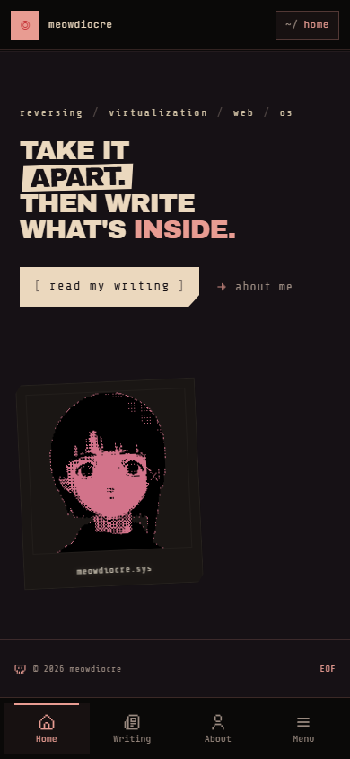
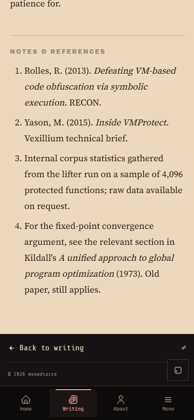
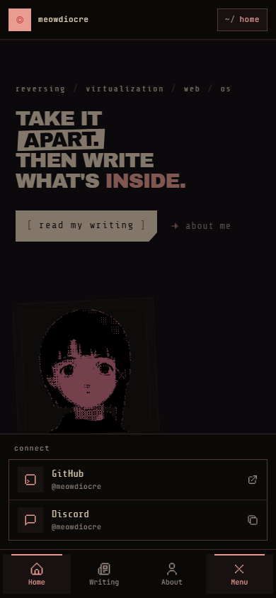
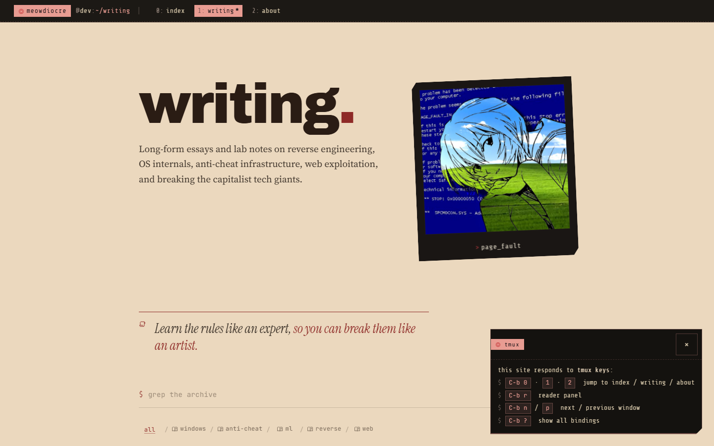
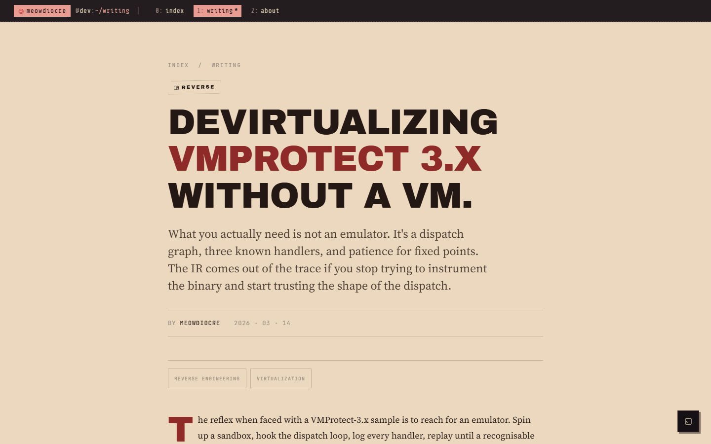
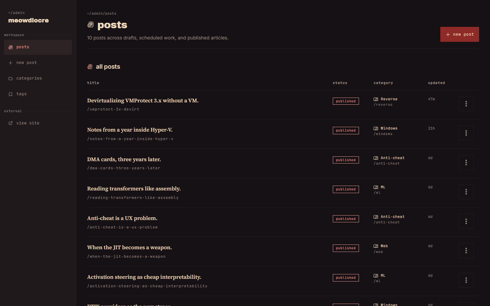
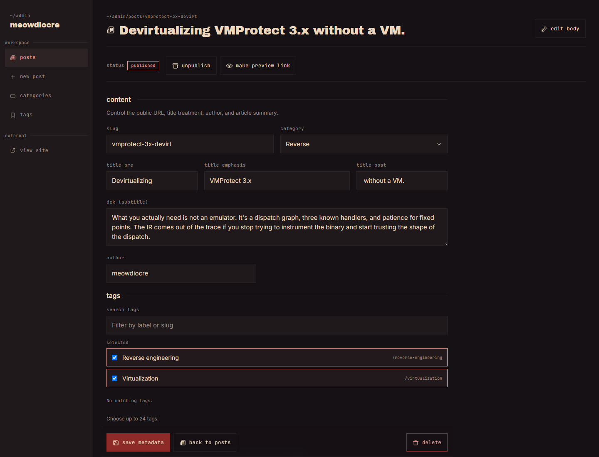
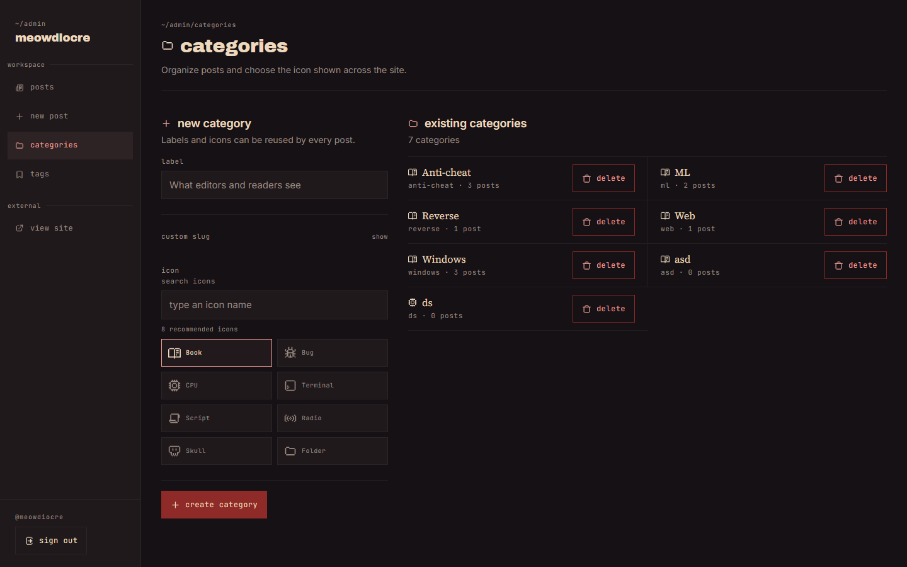
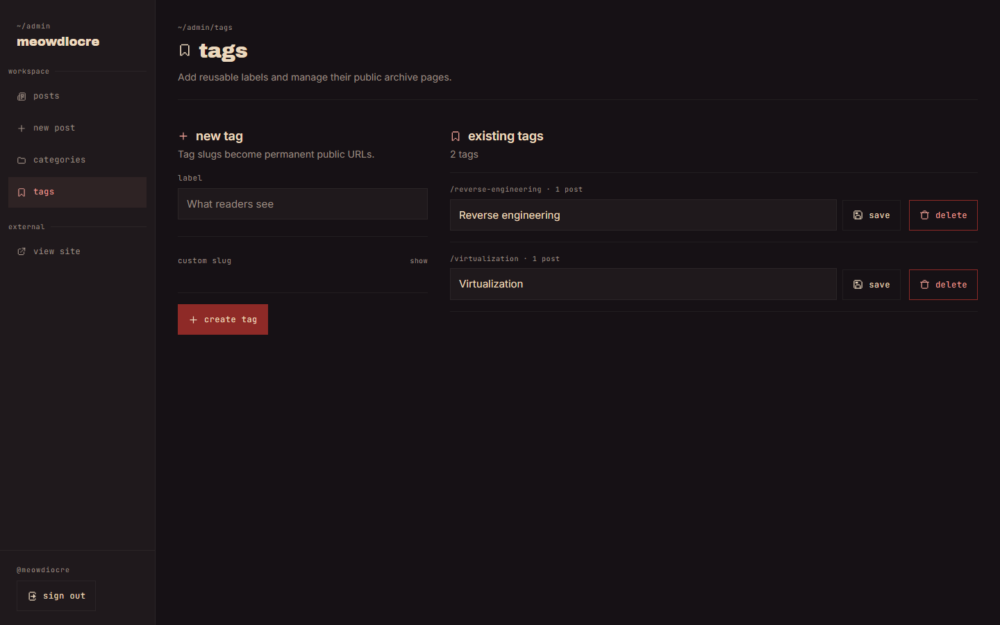

# meowdiocre

Personal technical writing site and private publishing CMS built with SvelteKit.

The public site presents long-form articles, category archives, tag archives, related posts, thumbnails, RSS, and complete social metadata. The private admin handles drafting, rich-text editing, media, SEO, publishing, categories, and tags.

## Screenshots

| Homepage | Mobile homepage |
| --- | --- |
|  |  |

| Mobile article footer | Mobile social menu |
| --- | --- |
|  |  |

| Writing index | Article page |
| --- | --- |
|  |  |

| Admin post list | Post metadata |
| --- | --- |
|  |  |

| Category management | Tag management |
| --- | --- |
|  |  |

## Functionality

### Public site

- Homepage, about page, writing index, and article pages
- Canonical article URLs at `/blog/[category]/[slug]`
- Public tag archives at `/blog/tag/[slug]`
- Writing index grouped by year with search and category filtering
- Article thumbnails, related posts, reader controls, sidenotes, and footnotes
- Linked article tags
- RSS feed at `/feed.xml`
- XML sitemap and `robots.txt`
- Per-post canonical URL, title, description, social image, social image alt text, and `noindex`
- Open Graph and Twitter metadata

### Admin

- GitHub OAuth with a single allowed administrator
- Draft creation and metadata editing
- TipTap editor with links, images, code blocks, pull quotes, sidenotes, and end slugs
- Server-rendered Shiki code highlighting
- Thumbnail upload and URL selection
- Searchable icon picker for categories
- Searchable many-to-many tag selector for posts
- Manual publish, unpublish, signed previews, and scheduled publishing
- Safe category deletion by moving related posts or permanently deleting them
- Tag create, label edit, and deletion without deleting related posts
- Loading states and duplicate-submit protection for admin actions

## Stack

- SvelteKit 2 and Svelte 5
- Tailwind CSS 4
- Drizzle ORM
- Neon Postgres
- TipTap
- Shiki
- GitHub OAuth through Arctic
- Vercel Blob
- Vitest and Playwright

## Content pipeline

1. The editor stores the canonical TipTap document in `posts.doc_json`.
2. Saving content renders escaped article HTML on the server.
3. Shiki highlights code blocks during rendering.
4. The cached result is stored in `posts.body_html`.
5. Public article routes read the cached HTML and structured metadata.

This keeps expensive editor conversion and syntax highlighting out of the public request path.

## Database

| Table | Purpose |
| --- | --- |
| `posts` | Article metadata, editor JSON, cached HTML, publishing state, thumbnails, and SEO |
| `categories` | Required primary classification and public icon |
| `tags` | Stable public tag labels and slugs |
| `post_tags` | Many-to-many post and tag associations |
| `media` | Uploaded image metadata |
| `users` | GitHub administrator identity |
| `sessions` | Hashed database sessions |

Category changes and destructive category deletion use atomic PostgreSQL statements. Post metadata and tag replacement use a Neon batch so they commit together.

## Project structure

```text
src/routes                 SvelteKit pages and endpoints
src/lib/components         Shared public and admin UI
src/lib/editor             TipTap extensions, dialogs, rendering, and parsing
src/lib/seo                SEO resolution helpers
src/lib/server             Auth, publishing, validation, and rendering
src/lib/server/db          Public and admin database queries
drizzle/migrations         Database migrations
scripts                    Seed, reset, and maintenance scripts
tests/e2e                  Playwright browser coverage
static/readme              README screenshots captured from the application
```

## Requirements

- Node.js `20.19+` or `22.12+`
- Neon Postgres
- GitHub OAuth application
- Vercel Blob store for uploads

## Local development

```bash
npm install
copy .env.example .env
npm run db:migrate
npm run seed
npm run dev
```

Open `http://localhost:5173`.

GitHub OAuth callback URL:

```text
http://localhost:5173/admin/callback
```

## Environment variables

| Variable | Purpose |
| --- | --- |
| `DATABASE_URL` | Pooled runtime database connection |
| `DATABASE_URL_UNPOOLED` | Direct connection for migrations and scripts |
| `GITHUB_CLIENT_ID` | GitHub OAuth client ID |
| `GITHUB_CLIENT_SECRET` | GitHub OAuth client secret |
| `ADMIN_GITHUB_LOGIN` | Only GitHub login allowed into `/admin` |
| `SESSION_SECRET` | Signing secret for draft preview links |
| `VERCEL_REVALIDATE_URL` | Deployed origin used to refresh cached public routes |
| `CRON_SECRET` | Bearer token for the scheduled publishing endpoint |
| `BLOB_READ_WRITE_TOKEN` | Vercel Blob upload token |
| `PUBLIC_SITE_URL` | Public origin used for canonical URLs and OAuth |
| `E2E_AUTH_SESSION` | Optional admin session token for authenticated Playwright coverage |

Generate secrets with Node.js:

```bash
node -e "console.log(require('crypto').randomBytes(48).toString('base64'))"
```

## Commands

| Command | Purpose |
| --- | --- |
| `npm run dev` | Start the development server |
| `npm run build` | Build the production bundle |
| `npm run preview` | Preview the production build |
| `npm run check` | Run Svelte diagnostics and type checks |
| `npm run test` | Run Vitest once |
| `npm run test:watch` | Run Vitest in watch mode |
| `npm run test:e2e` | Run Playwright browser tests |
| `npm run icons:generate` | Rebuild the local pixel icon registry |
| `npm run db:generate` | Generate a Drizzle migration |
| `npm run db:migrate` | Apply pending migrations |
| `npm run db:studio` | Open Drizzle Studio |
| `npm run db:reset` | Reset development database content |
| `npm run seed` | Seed categories and sample posts |

## Scheduled publishing

The protected endpoint is:

```text
POST /admin/api/cron/publish
Authorization: Bearer <CRON_SECRET>
```

`vercel.json` calls it daily. `.github/workflows/scheduled-publish.yml` can call it every five minutes using these GitHub repository secrets:

- `CRON_BASE_URL`
- `CRON_SECRET`

`CRON_BASE_URL` is the deployed site origin. Its `CRON_SECRET` must match the Vercel environment value.

## Verification

```bash
npm run check
npm run test
npm run test:e2e
npx drizzle-kit check
```

## Contributing

Read [CONTRIBUTING.md](./CONTRIBUTING.md), [CODE_OF_CONDUCT.md](./CODE_OF_CONDUCT.md), and [docs/CODE_STYLE.md](./docs/CODE_STYLE.md) before submitting changes.
